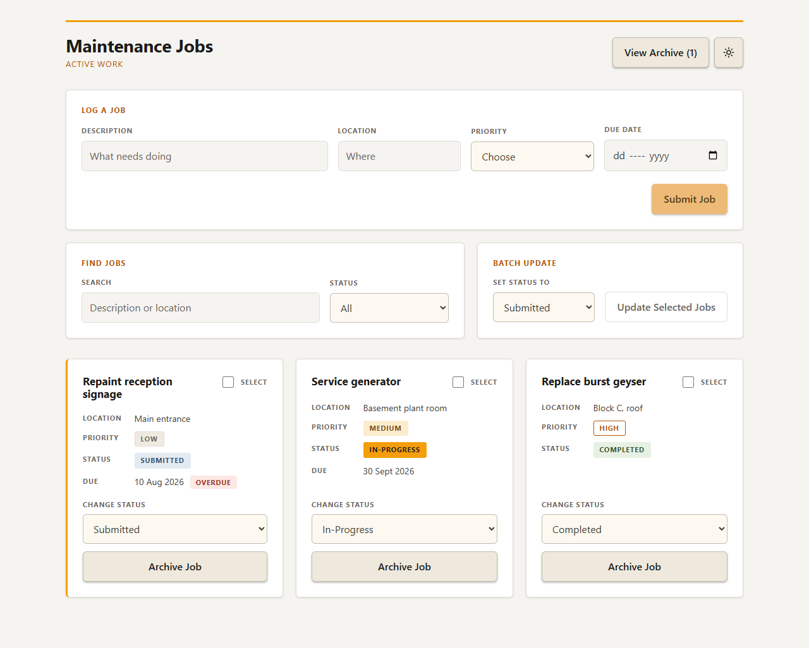
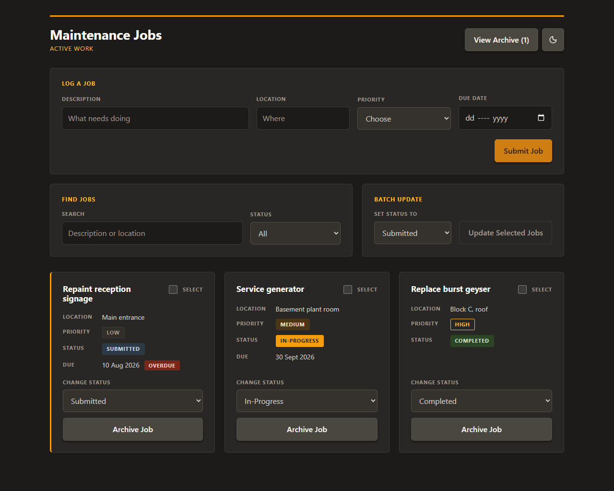

# Jobs-To-Do-List

A maintenance job tracker where the work that is late tells you so. Jobs carry a
priority and a due date, overdue ones are worked out on the fly rather than
stored, and anything archived can be restored or deleted for good.

## Live demo

**https://jobs-app.szstanton.com**

No sign-up, no account. The API runs on a free Render instance that sleeps after
about 15 minutes idle, so the first load can take up to a minute to wake it. The
page says so while it waits.

## Screenshots

**The dashboard, light and dark**




## Features

- Log jobs with a description, location, priority and an optional due date
- Overdue jobs are flagged automatically, with no scheduled task to run
- Filter by status and search description and location together
- Update several jobs at once, acting only on what is currently on screen
- Archive jobs, then restore them or delete them permanently
- Light and dark themes, remembered between visits

## Tech stack

| Area     | Built with                                   |
| -------- | -------------------------------------------- |
| Frontend | React, Vite, Axios                           |
| Backend  | Node.js, Express                             |
| Database | MongoDB, Mongoose                            |
| Testing  | Vitest, Testing Library                      |
| Hosting  | Vercel (client), Render (API), MongoDB Atlas |

## Getting started

```bash
git clone https://github.com/SZStanton/jobs-app
cd jobs-app
npm install
```

One install from the root covers both workspaces.

Copy `server/.env.example` to `server/.env` and `client/.env.example` to
`client/.env`, then fill in:

| Variable        | Where  | What it is                                                     |
| --------------- | ------ | -------------------------------------------------------------- |
| `MONGODB_URI`   | server | Atlas connection string. The database name goes before the `?` |
| `CLIENT_ORIGIN` | server | Origin allowed by CORS, `http://localhost:5173` locally        |
| `PORT`          | server | Only needed locally. Render sets its own                       |
| `VITE_API_URL`  | client | Where the API lives, `http://localhost:3000` locally           |

Then:

```bash
npm run dev     # API and client together
npm test        # the full suite
npm run build   # production build of the client
```

## Testing

68 tests run from a clean clone with no database and no credentials: Mongoose
validates the schema without a connection, and the components run against a
mocked API.

```bash
npm test
```

The suite is pinned to a timezone behind UTC. The due date logic is correct at
UTC+2 whether or not the bug it guards against is present, so tests running in
local time would have passed against broken code.

## What I Learned

- **Mongoose gives a schemaless database a shape.** Declaring the fields, types,
  enums and defaults in one schema means every job that reaches the database
  looks the same, and the rest of the app talks to a model instead of a
  collection.
- **Splitting routes, controllers and models.** Routes say what exists,
  controllers say what happens, models say what a job is. This was the first
  backend I wrote that was not one long file.
- **A React app and an Express API are two separate programs.** They only meet
  at a URL, so everything shared has to travel as JSON, and the browser blocks
  the request unless the server says that origin is allowed.
- **Updating many records at once is its own operation.** `updateMany` with
  `$in` does in one request what a loop of single updates would do in twenty,
  which is what made selecting several jobs and setting them all worth building.
- **Coming back to it later: a form is not validation.** The browser's
  `required` only stops honest mistakes, and the same rules have to exist on the
  server, where Mongoose needs to be told to run them on updates as well as
  creates.
