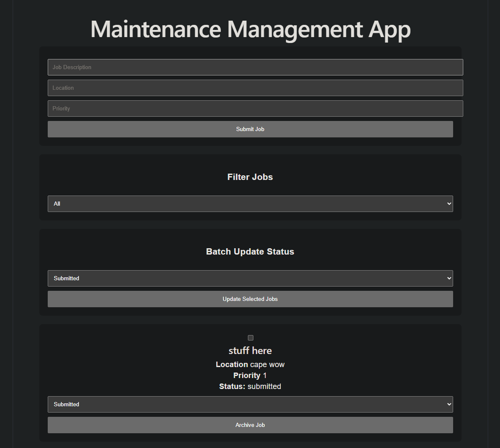

# Jobs-To-Do-List

A full-stack job-tracking tool for logging, filtering, and updating maintenance jobs. This project demonstrates full CRUD functionality across a React frontend and an Express/MongoDB backend, including batch operations on multiple records at once.

## Screenshots

<table>
  <tr>
    <td></td>
  </tr>
</table>

## Features

- Submit jobs with description, location, and priority
- Filter jobs by status
- Batch-update the status of multiple selected jobs at once
- Archive completed jobs
- Full CRUD (create, read, update, delete) on job records

## Tech Stack

**Frontend:** React, Axios

**Backend:** Node.js, Express, MongoDB, Mongoose

## Project Structure

**Backend:** middleware, routes, controllers, models, server.js

## Installation

1. Clone the repository

   ```bash
   git clone https://github.com/SZStanton/Jobs-App
   ```

2. Navigate into the project folder and install dependencies for both frontend and backend

   ```bash
   npm install
   ```

3. Set up your environment variables (`.env`) with your MongoDB connection string

4. Run the backend

   ```bash
   npm run server
   ```

5. Run the frontend

   ```bash
   npm run dev
   ```

6. Open the app in your browser

   ```bash
   http://localhost:5173/
   ```

## Future Improvements

- Job assignment to specific team members
- Due dates and overdue alerts
- Search by keyword across job descriptions
- Export job list to CSV
